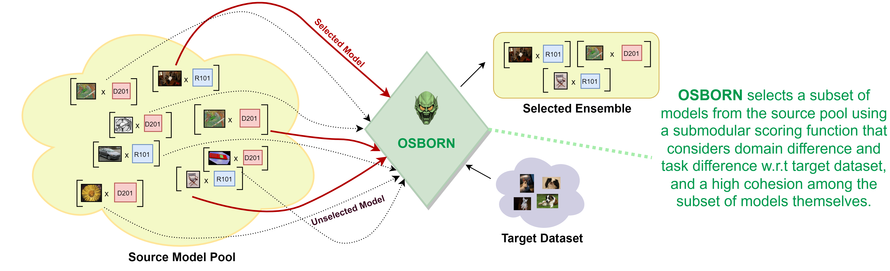

## [ICCV2023] Building a Winning Team: Selecting Source Model Ensembles using a Submodular Transferability Estimation Approach
  

  

Figure 1: Given a source pool containing M datasets accompanied by a pre-trained model each and a target dataset, OSBORN selects a subset of models i.e., an Ensemble such that the Domain Difference, Task Difference are low and the Model Cohesion is high by employing a submodular approach. Please refer to Section 1 of the paper for more details.

  

